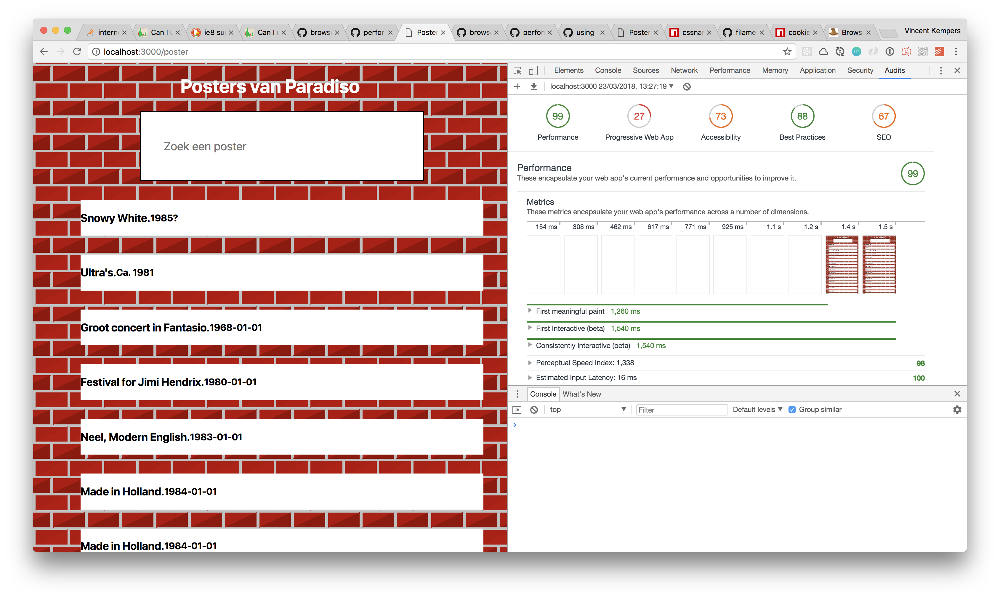
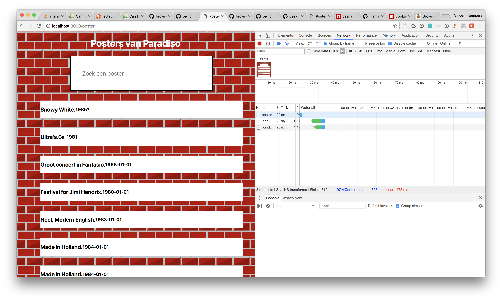
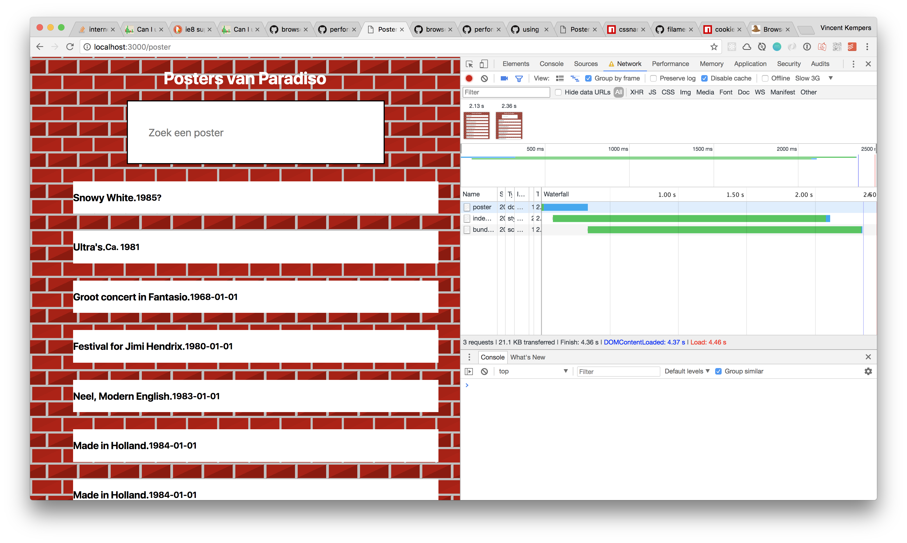
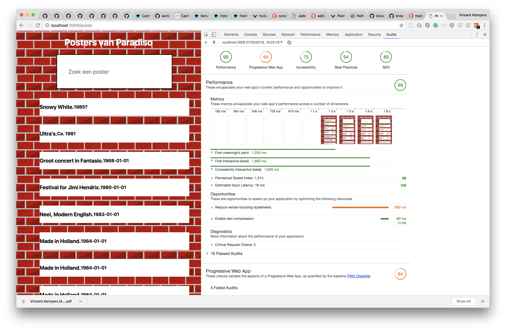
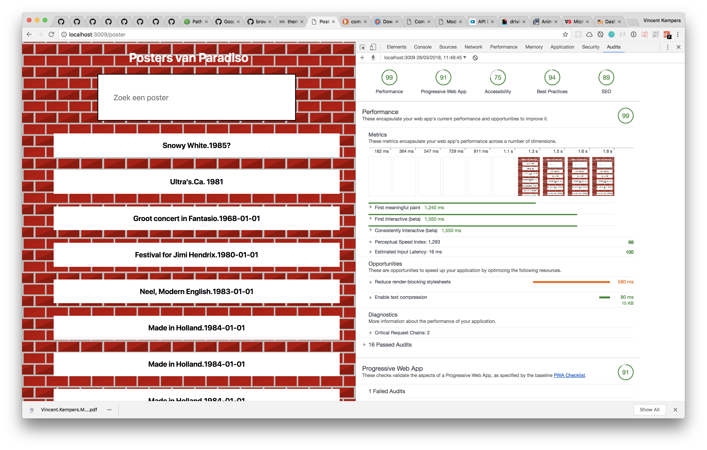

# performance-matters-server-side

## Poster Paradiso
You can look up posters from old concerts that took place in Paradiso! This App will be tested on performance and eventually be a Progressive Web App (PWA).

### How to run
`npm install`

to run the server
`npm test`

Server will be run on `localhost:3009`


## Performance

On the performance side after I made a server with nodeJS and expressJS. As template renderer i used 'Pug' formally 'Jade'.

### Modules
* [expressJS](https://expressjs.com/)
* [Pug](https://pugjs.org/api/getting-started.html)
* [nodemon](https://nodemon.io/)
* [body-parser](https://www.npmjs.com/package/body-parser)
* [browserify](http://browserify.org/)
* [path](https://nodejs.org/docs/latest/api/path.html)
* [request](https://github.com/request/request)


### usage express

```JS
var express = require('express');
var app = express();

app.set('view engine', 'pug');

app.get('/', function(req, res){
  res.redirect('/poster')
})
```

### usage Pug

All the Pug files are located in `/views`.

```JS
h1 Posters van Paradiso
ul#myUL
  each key in data
    li
      a(href="/poster/" + key.title)
        h3= key.title
          span= key.date
```


### bodyParser

bodyParser is the middle man between the request content and the server.
Used for the request:
`app.use(bodyParser.urlencoded({extended: false}));`


### request
Request is a module that makes a simple get(xhr) request, and works the following:

```JS
var request = require('request');
request('URL', function (error, response, body) {
  console.log(error); // Print the error if one occurred
  console.log(response); // Print the response status code if a response was received
  console.log(body); // Print the HTML  homepage.
});
```


### audits


_99! performance matters_


_Fast 3g Speeds_


_Slow 3g Speeds_


These audits were made after implementing browserify!


## Progressive Web App

So starting with this assignment I had an audit score of 27.


### Service Worker
A service worker is a virtual middleman that actually passes data through. When you have a server running and you _don't_ have a server running it will make a request every single time. With a service worker you can store it efficiently in the cash and make the client (the browser) talk to the service worker instead of your server. This will make the experience a bit better.. Why? well for example:

- If the connection is poor of badly you can make your application still work. Pages that are cached will be showed anyway. if not? there will be an error page (you will need to have an error page).

- The call to server is minimum what means that the server can just be called when a user don't have a the page stored.

### My implementation of the service worker

The first thing the server worker does is getting the CSS the /offline page and the bundled JavaScript. He will cache this under cache name poster-v1. When there will be a new version you can just change the storage name to v2. In the the last `.then` we skipWaiting to stop the double refresh problem.

```JS
this.addEventListener('install', function(event){
  event.waitUntil(
    caches.open('poster-v1')
    .then(cache => cache.addAll([
      '/offline',
      '../index.css',
      '../bundle.js'
    ]))
    .then(this.skipWaiting())
  )
});
```

On the fetch (every time the client wants to go 'somewhere' in the app) we will use the event to read the request. From that request we will pick up the request and cache the page! When the page doesn't have the Cache it will get the server in on this. If that doesn't work show the offline page.

```JS
this.addEventListener('fetch', function(event) {
  const request = event.request;
  if(request.mode === 'navigate') {
    event.respondWith(
      fetch(request)
        .then(response => cachePage(request, response))
        .catch(error => fetchCachedPage(request))
        .catch(error => fetchOnlineFiles('/offline'))
    );
  } else {
    event.respondWith(
      fetch(request)
        .catch(error => fetchOnlineFiles(request.url))
    );
  }
});
```

After implementing this cache it boosted a-lot of the Progressive web app chart.
What i ticked off was:
* [x] Have an error page.
* [x] Cache the error page.
* [x] Have the cache on every page that the client goes.
* [x] I had a start with my manifest, which included the "name" and "description" "short_name".



After having the victory dance. I started digging in the rest of the errors wich mostly took place in the `manifest.json`.

```json
{
  "name": "Paradiso Posters",
  "short_name": "Posters",
  "start_url": "?homescreen=1",
  "display": "standalone",
  "background_color": "#bb0200",
  "description": "Een simpele app waar je oude concert posters kan vinden van Paradiso",
  "orientation": "portrait",
  "theme_color": "#bb0200",
  "icons": [{
    "src": "/apple-icon.png",
    "sizes": "100x100",
    "type": "image/png"
    }]
}
```

After adding this in with my custom image it would still want another icon, a 512px icon (example of icon [200px icon](https://github.com/VincentKempers/performance-matters-server-side/blob/master/imgs/icon-200.png)).

* [x] `theme_color`
* [x] `icons: [ { } , { } ]`
* [x] `orientation`


After adding the 512px in the manifest in the array of icons.




### Sources
* [Joost Faber](https://github.com/joostf)[ example how request works](https://github.com/cmda-minor-web/performance-matters-bootstrap/tree/master/examples/simple-server)

* [Fetch event](https://developer.mozilla.org/en-US/docs/Web/API/FetchEvent)
* [respondWith](https://developer.mozilla.org/en-US/docs/Web/API/FetchEvent/respondWith)
* [skipWaiting](https://developer.mozilla.org/en-US/docs/Web/API/ServiceWorkerGlobalScope/skipWaiting)
* [match](https://developer.mozilla.org/en-US/docs/Web/API/Cache/match)
* [caching-files-with-service-worker](https://developers.google.com/web/ilt/pwa/caching-files-with-service-worker)
* [Voorhoede workshop CMD, Thanks Voorhoede](https://github.com/voorhoede/workshop-cmd-pwa/)
